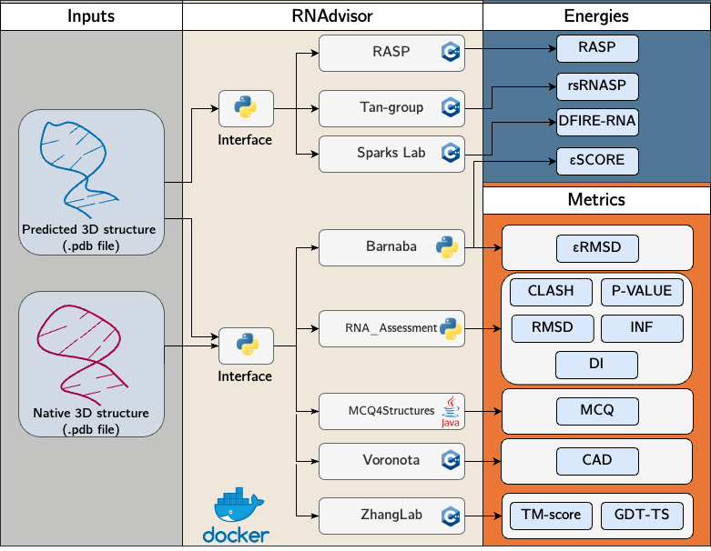

<h1 align="center">
  RNAdvisor: RNA 3D structure metrics and energies assessment
</h1>





This depo summarises different implementations of scoring function for 3D structures of RNA

## General overview


This code implements 4 existing repositories and adds a python interface. 

It takes as inputs a `.pdb` file of predicted 3D structures (or a folder of `.pdb` files) and a `.pdb` file of a native structure, and it returns a `.csv` file with the different metrics. 

It uses the following repositories: 

- [RNA_Assessment](https://github.com/RNA-Puzzles/RNA_assessment): a python repository that computes [RMSD](#rmsd), [P-VALUE](#p-value), [INF](#inf), and [DI](#di). 

    I forked the project because I did some modifications, leading to use the following implementation of [RNA_Assessment-forked](https://github.com/clementbernardd/RNA_assessment/tree/scoring-version)
- [MCQ4Structures](https://github.com/tzok/mcq4structures) : a java code that computes the [MCQ](#mcq) score. 
- [Voronota](https://github.com/kliment-olechnovic/voronota): a C++ code that computes the [CAD](#cad) score. 
- [Zhanglab](https://zhanggroup.org/TM-score/): a complete website to compute multiple scores, such as the [GDT-TS](#gdt-ts) scores.
- [BaRNAba](https://github.com/srnas/barnaba): an implementation of the eRMSD and eSCORE. I created a fork version of [BaRNAba-forked](https://github.com/clementbernardd/barnaba/tree/scoring-version).
- [DFIRE](https://github.com/tcgriffith/dfire_rna): an implementation of the DFIRE energy function. 
- [RASP](http://melolab.org/webrasp/download.php): an implementation of the RASP energy function. I created a fork version of [RASP-forked](https://github.com/clementbernardd/rasp_rna)
- [rsRNASP](https://github.com/Tan-group/rsRNASP): a Python implementation of the rsRNASP score. I created a fork version of [rsRNASP-forked](https://github.com/clementbernardd/rsRNASP/tree/scoring-version) with only the needed files.
- [OpenStructure](https://git.scicore.unibas.ch/schwede/openstructure): a C++ and Python implementation for structure analysis. It is used to compute [TM-score](#tm-score) and [lDDT]($lddt) metrics. 


Note that all these repositories are implementing a lot of different functions. For the sake of this project, I just took what seemed to be the most relevant for the scoring of 3D structures. 


## Installation

### Docker

A docker image has been developed to ensure all the dependencies are installed. Indeed, this code depends on C++, python and java scripts.

To install the image, use:
```
make docker_start
```
It will build the image, named `rnadvisor`, and then run the container with two volumes (`docker_data` and `tmp`) and use the `--config_path` argument.
Therefore, the parameters (like the path of the inputs, outputs, etc) are stored in the `config.yaml` file.

To debug the code or go inside the container, you can use the dev mode.
To launch it, use:
```
make docker_interactive
```
It will run the container and launch the `/bin/bash` command. You would then need to run `python -m src.rnadvisor_cli` with the needed parameters if you want to run the code.

If you want to manually build and run the docker, you can see the details in the `Makefile`.

Note that the `Dockerfile` contains multiple stage (one stage for each repo), so you need to build to final stage (called `release`, and `dev` for the dev stage):
```
docker build -t rna_scores --target release .
```

Then, as the entrypoint in the `Dockerfile` is `python -m src.rnadvisor_cli`, you just need to provide the arguments for the commands in the running process:
```
docker run -it -v ${PWD}/docker_data/:/app/docker_data -v ${PWD}/tmp:/tmp rna_scores --config_path=./config.yaml
```
Note that there are mounted volumes to ensure that the inputs can be read by the container.


### Parameters

#### Using config.yaml
Here are the different parameters found in the `config.yaml`: 

```yaml
BIN_PATHS:
  # Bin paths: nothing to change if you follow the installation instructions
  RNA_ASSESSMENT: "lib/rna_assessment/MC-Annotate"
  ZHANG_GROUP: "lib/zhanggroup/TMscore"
  DFIRE: "lib/dfire/bin/DFIRE_RNA"
  MCQ4STRUCTURES: "lib/mcq4structures/mcq-cli/mcq-local"
  RASP: "lib/rasp/bin/rasp_fd"
  rsRNASP: "lib/rs_rnasp/rsRNASP"
SCORE_HP:
  PRED_PATH: "docker_data/input/MODEL_1"
  NATIVE_PATH: "docker_data/input/NATIVE/1Z43.pdb"
  RESULT_PATH: "docker_data/output/test_scores.csv"
  TIME_PATH: "docker_data/output/time_score.csv"
  LOG_PATH: "docker_data/log/out.log"
  NORMALISATION: true
  SORT_BY: RMSD
  VERBOSE: false
  ALL_SCORES:
    - RMSD
    - P-VALUE
    - INF
    - DI
    - MCQ
    - TM-SCORE
    - CAD
    - RASP
    - CLASH
    - BARNABA
    - DFIRE
    - rsRNASP
    - lDDT
    - QS-SCORE
```

Note that the variables in the `BIN_PATH` are the default values when you install the code using the provided installation scripts.

For the `Score_HP`, the variables are the ones to provide for the python script: 
- `PRED_PATH`: the path to either a directory or a `.pdb` file of predicted structures
- `NATIVE_PATH`: the path to the `.pdb` native structure
- `RESULT_PATH`: the path where to store the output (a `.csv` file)
- `TIME_PATH`: the path where to store the time of each metric (a `.csv` file)
- `LOG_PATH`: the path where to store the log of the script (a `.log` file)
- `VERBOSE`: whether to print the debug logs in the console
- `NORMALISATION`: whether to normalise the `.pdb` files (it uses the normalisation from `RNA_Assessment`)
- `SORT_BY`: whether the user wants to sort the result by one of the metric. It could be `RMSD`, `P-VALUE`, `INF-ALL`, `INF-WC`, `INF-NWC`, `INF-STACK`, `DI`, `MCQ`, `TM-SCORE`, `GDT-TS`, `GDT-TS@1`, `GDT-TS@2`, `GDT-TS@4`,`GDT-TS@8` or `CAD`.
- `ALL_SCORES`: a list of scores to compute. It can be `RMSD`, `P-VALUE`, `INF`, `DI`, `MCQ`, `TM-SCORE`, `lDDT` and `CAD`. Note that there is also available the `QS-score`. 

### Scenario

We provide different scenario of use for our tool.
These scenarios can be computed by changing the `ALL_SCORES` parameters in the config file or in the command line.

- **Full decoys** (`FULL_DECOYS`): scenario where all the available scoring functions are computed. This scenario is set to have a complete set of scoring functions for high accuracy in the near-native structures assessment.
- **Decoys limited** (`DECOYS_LIMITED`): scenario to get near-native structures from scoring functions but with a limited computation capability. It also minimises the CO2 consumption. It uses the `DFIRE-RNA` and `eSCORE` to bring quick computation for large benchmarks.
- **All metrics** (`ALL_METRICS`): scenario for computing all the metrics. It is used when all the metrics are interesting for experimentation and the computation time is not restricted.
- **Distinct metrics** (`DISTINCT_METRICS`): scenario where only the main metrics with low computation time are to be used. It also has a low CO2 consumption.  It gathers the `DI`, `GDT-TS` and `MCQ` metrics. 


#### Using CLI

If you want to use the command lines, here are the option available to run the script : 
```
python -m src.rnadvisor_cli --pred_path --native_path --result_path --time_path --log_path
          [--all_scores] [--config_path] [--no_normalisation] [--sort_by] [--verbose]
```
with: 
```
arguments: 
  --pred_path           Directory to .pdb files or path to a .pdb file of the predictions. 
  --native_path         Path to a .pdb file of the native structure.
  --result_path         Path to a directory where to store the different scores.
  --time_path           Path to a directory where to store the time of each metric.
  --log_path            Path to a directory where to store the log of the script.
  --verbose             If the user wants to print the debug logs in the console.
  --all_scores          List of the scores to use, separated by a comma. 
                        If you want to use them all, use `ALL`. To use all the metrics, use `METRICS`
                        To use all the energies, use `ENERGIES`.
                        Choice between RMSD,P-VALUE,INF,DI,MCQ,TM-SCORE,CAD,lDDT,RASP,CLASH,BARNABA,DFIRE,rsRNASP.
  --no-normalisation    If the user doesn't want to normalise the .pdb files. 
  --sort-by             Metric to sort the results by. Choice between RMSD,P-VALUE,INF-ALL,INF-WC,INF-NWC,INF-STACK,DI,MCQ,TM-SCORE,GDT-TS,GDT-TS@1,GDT-TS@2,GDT-TS@4,GDT-TS@8,CAD,lDDT,RASP,BARNABA,DFIRE,rsRNASP.
  --config_path         Path to the config.yaml file with the different parameters.
```

If you use the `config_path`, it will not take into account the other parameters (and only take into account what is specified in the `config.yaml` file)


An example of use would be: 

```
python -m src.rnadvisor_cli --pred_path=docker_data/input/MODEL_1 --native_path=docker_data/input/NATIVE/1Z43.pdb --result_path=docker_data/output/ --time_path=docker_data/output/time.csv --all_scores=ALL
```

## Description
Here is a basic explication of the different scores, such as the original papers.
### General metrics

There are two metrics that aim to give a general idea of how well two 3D structures are compare to each other.
#### RMSD
The RMSD is described as the Root-mean-square deviation of two molecules.

It usually uses some rotation to have a representative value of RMSD.

There are multiple repositories that implement this metrics, such as:
- [rmsd](https://github.com/charnley/rmsd)
- [RNA_Assessment](https://github.com/RNA-Puzzles/RNA_assessment)
- [RNA-tools](https://github.com/mmagnus/rna-tools)


#### CLASH

This is described as the number of bad overlaps per 1000 atoms.

This is based on [[Davis and all]](#1) paper.

I didn't succeed in implementing this score. I didn't manage integrating them to my code. Here is a list of repositories that seem to implement this score:

- [MolProbity](https://github.com/rlabduke/MolProbity): original paper implementation.
- [RNA-tools](https://github.com/mmagnus/rna-tools): it depends on [Phenix](https://phenix-online.org/), which is not open-source. See the [documentation](https://rna-tools.readthedocs.io/en/latest/tools.html?highlight=clash#module-rna_tools.tools.mq.ClashScore.ClashScore).
- [rnaqa](https://github.com/mantczak/rnaqua): a java tool similar to this repo that implements different scores.

### RNA-oriented metrics

Compared to general metrics, scoring methods have been developed to take into account the locality of RNA specificities.

#### P-VALUE

The P-value aims to assess the global fold of an RNA at roughly “nucleotide resolution”. This is based on the [RMSD](#rmsd).

Note that this metric is relevant for structures between 35 and 161 nucleotides, as mentioned in the original paper [[2]](#2).

#### INF

This INF (Interaction Network Fidelity) metric was invented to assess the central characteristics of RNA architecture.
This is the Matthews correlation coefficient of interaction prediction.

```math
INF = \sqrt{\frac{TP}{TP+FP} \times \frac{TP}{TP+FN}}
```

The INF can either measure different interaction types (WC base-pairing, non-WC base pairing, base stacking) separately or combine all of the types (resulting in INFwc, INFnwc, INFstacking and INFall)

It is based on the paper [[3]](#3).


#### DI

The DI (Deformation Index) metric is defined to balance the RMSD by a local value.

This is defined as:

```math
DI = \frac{RMSD}{INF}
```
This paper [[3]](#3) mentioned this metric such as the Deformation Profile (DP), which is a distance matrix representing the average distance between a predicted model and a reference model.


#### MCQ

The MCQ score (Mean of Circular Quantities) gives a comparison in torsion angle space. Indeed, it assumes that small deviation in angle may result in topological deviation.

The mathematical definition is quite complex, defined as:
```math
MCQ(S_T, S'_T) = arctan( \frac{1}{r|T|} \sum_{i=1}^r \sum_{j=1}^{|T|} sin \Delta (t_{ij} , t'_{ij})       ,  \frac{1}{r|T|} \sum_{i=1}^r \sum_{j=1}^{|T|} cos \Delta (t_{ij} , t'_{ij})          )
```
where $r$ is a number of residues in $S \cap S'$ and $T$ a set of torsion angles.
We also have:

```math
\Delta(t, t') = \left\{
        \begin{array}{lll}
             0  \qquad \qquad \qquad \qquad \qquad \qquad \qquad   \text{if both t and t' are undefined } \\ 
            \pi  \qquad \qquad \qquad \qquad \qquad \qquad \qquad \text{if either t or t' is undefined}  \\
            min(\text{diff}(t, t'), 2\pi - \text{diff}(t, t'))) \quad  \text{otherwise} 
        \end{array}
    \right. 
```


The original source code is the [MCQ4Structures](https://github.com/tzok/mcq4structures), adapted from [[4]](#4).


### Protein-based metrics

Even if RNA and proteins are different, some metric functions from proteins can be adapted to RNA.

### CAD-score

The CAD score (Contact Area Difference) aims to measure the structural similarity in a contact-area difference-based function.

It has been described for proteins [[6]](#6), and then adapted for RNA [[7]](#7).

If we denote the contact area between residues `i` and `j` in the reference structure as $T_{(i,j)}$, and the contact area in the predicted model as $M_{(i,j)}$, the $CAD_{score}$ is defined as:

```math

CAD_{score} = 1-\frac{  \sum_{(i,j) \in G}  min( |T_{(i,j)} - M_{(i,j)}  ,  T_{(i,j)})         }{ \sum_{(i,j) \in G} T_{(i,j)} }

```


#### TM-score
The TM-score (Template-Modeling) aims to give a metric that isn't dependent of the length of the structures.

This is adapted to RNA in [[5]](#5), where the TM-score is defined as:

```math

TM_{score_{RNA}} = \frac{1}{L}\sum_{i=1}^{L_{ali}} \frac{1}{1 + (\frac{d_i}{d_0})^2}

```
with $d_0 = 0.6 \sqrt{L-0.5} - 2.5$ the scaling factor to ensure the score of random RNA pairs is independent of RNA length.


### GDT-TS

The GDT-TS score (Global Distance Test Total Score) denote the sum of percent of residues that are within 1,2,4 and 8Å between a model and a reference structure, divided by 4.

This is a value that varies between 0 and 1, inspired by the protein metrics.

It has been adapted from the CASP competition [[8]](#8).

### lDDT

The local distance difference test (lDDT) assesses the interatomic distance differences between a reference structure and a predicted one. 

It does not require any superposition. 

The lDDT considers all the pairs of atoms in the reference structure within a default distance. The atom pairs define a set of distances `L`, which is used for a predicted model. 
A distance in the prediction is preserved if, given a threshold, it is the same as its corresponding distance in `L`. 
The lDDT is thus derived using four different thresholds: 0.5 Å, 1 Å, 2 Å, and 4 Å. 
lDDT is the average of four fractions of conserved distances within the four thresholds. 

It ranges between 0 and 1, where 1 means a perfect reconstruction of interatomic distances.

It comes from [[14]](#14)

## Citation 
```
Clement Bernard, Guillaume Postic, Sahar Ghannay, Fariza Tahi,
RNAdvisor: a comprehensive benchmarking tool for the measure and prediction of RNA structural model quality,
Briefings in Bioinformatics, Volume 25, Issue 2, March 2024, bbae064,
https://doi.org/10.1093/bib/bbae064
```

## References
<a id="1">[1]</a> 
Davis, I. W., Leaver-Fay, A., Chen, V. B., Block, J. N., Kapral, G. J., Wang, X., Murray, L. W., Arendall, W. B., Snoeyink, J., Richardson, J. S., & Richardson, D. C.(2007). 
MolProbity: all-atom contacts and structure validation for proteins and nucleic acids. 
Nucleic Acids Research, 35(Web Server), W375–W383. 
https://doi.org/10.1093/nar/gkm216

<a id="2">[2]</a> 
Hajdin, C. E., Ding, F., Dokholyan, N. v., & Weeks, K. M. (2010). 
On the significance of an RNA tertiary structure prediction. 
*RNA*, *16*(7), 1340–1349. 
https://doi.org/10.1261/rna.1837410

<a id="3">[3]</a> 
Parisien, M., Cruz, J. A., Westhof, É., & Major, F. (2009). 
New metrics for comparing and assessing discrepancies between RNA 3D structures and models. 
*RNA*, *15*(10), 1875–1885. 
https://doi.org/10.1261/rna.1700409

<a id="4">[4]</a> 
Zok, T., Popenda, M., & Szachniuk, M. (2014). 
MCQ4Structures to compute similarity of molecule structures. 
Central European Journal of Operations Research, 22(3), 457–473. 
https://doi.org/10.1007/s10100-013-0296-5


<a id="5">[5]</a> 
Sha Gong, Chengxin Zhang, Yang Zhang. 
RNA-align: quick and accurate alignment of RNA 3D structures based on size-independent TM-scoreRNA.
Bioinformatics, Volume 35, Issue 21, 1 November 2019, Pages 4459–4461. 
https://doi.org/10.1093/bioinformatics/btz282

<a id="6">[6]</a> 
Kliment Olechnovič, Eleonora Kulberkytė and Česlovas Venclovas (2013).
CAD-score: a new contact area difference-based function for evaluation of protein structural models. 
Proteins, 81:149–162.
https://doi.org/10.1002/prot.24172

<a id="7">[7]</a> 
Kliment Olechnovič and Česlovas Venclovas (2014) 
The use of interatomic contact areas to quantify discrepancies between RNA 3D models and reference structures. 
Nucleic Acids Res, 42:5407-5415
https://doi.org/10.1093/nar/gku191

<a id="8">[8]</a> 
Zemla A, Venclovas C, Moult J, Fidelis K. 1999. 
Processing and analysis of CASP3 protein structure predictions.
Proteins3:22–29
https://doi.org/10.1002/(SICI)1097-0134(1999)37:3+<22::AID-PROT5>3.0.CO;2-W

<a id="9">[9]</a> 
Miao, Z., & Westhof, E. (2017). 
RNA Structure: Advances and Assessment of 3D Structure Prediction. 
Annual Review of Biophysics, 46(1), 483–503. 
https://doi.org/10.1146/annurev-biophys-070816-034125

<a id="10">[10]</a>
Bottaro, Sandro, Francesco Di Palma, and Giovanni Bussi.
"The role of nucleobase interactions in RNA structure and dynamics."
Nucleic acids research 42.21 (2014): 13306-13314.

<a id="11">[11]</a>
T. Zhang, G. Hu, Y. Yang, J. Wang, and Y. Zhou,
“All-atom knowledge-based potential for RNA structure discrimination based on the
distance-scaled finite ideal-gas reference state.”,
J. Computational Biology, in press (2019).

<a id="12">[12]</a>
Capriotti E, Norambuena T, Marti-Renom MA, Melo F.
(2011) All-atom knowledge-based potential for RNA structure prediction and assessment.
Bioinformatics 27(8):1086-93

<a id="13">[13]</a>
Tan YL, Wang X, Shi YZ, Zhang W, Tan ZJ.
2022.
rsRNASP: A residue-separation-based statistical potential for RNA 3D structure
evaluation. Biophys J. 121: 142-156.

<a id="14">[14]</a>
Mariani, V., Biasini, M., Barbato, A., & Schwede, T. 
(2013). 
lDDT: a local superposition-free score for comparing protein structures and models using distance difference tests. 
Bioinformatics (Oxford, England), 29(21), 2722–2728. 
https://doi.org/10.1093/bioinformatics/btt473
